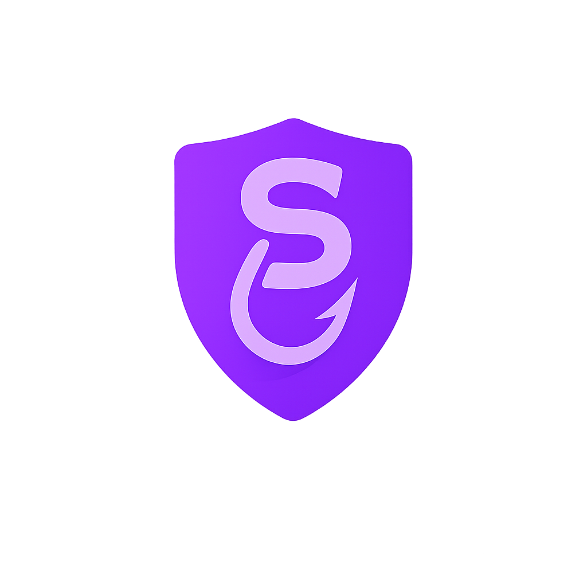

# SAFEHOOK — Não morda a isca.

<p align="center">
  
</p>

<p align="center">
  <strong>Plataforma educacional de Segurança da Informação</strong><br/>
  Conscientização · Avaliação de Maturidade · LGPD · Phishing · Gestão de Incidentes
</p>

---

## Visão Geral

O **SAFEHOOK** é uma plataforma web educacional voltada à conscientização em Segurança da Informação. Desenvolvida com foco em organizações e profissionais que desejam avaliar e fortalecer sua postura de segurança, a plataforma reúne ferramentas práticas de diagnóstico, treinamento e conformidade em uma interface moderna, acessível e totalmente em português.

---

## Objetivo

Capacitar colaboradores e organizações a identificar vulnerabilidades, compreender ameaças digitais (como phishing e engenharia social), avaliar o nível de maturidade em segurança e orientar boas práticas alinhadas à LGPD — tudo de forma gratuita e interativa.

---

## Principais Funcionalidades

| Funcionalidade | Descrição |
|---|---|
| **Avaliação de Maturidade** | Diagnóstico com 18 perguntas distribuídas em 6 categorias estratégicas: Controle de Acessos, Senhas e Autenticação, Backup e Continuidade, Conscientização, LGPD e Gestão de Ativos |
| **Simulador de Phishing** | Treinamento interativo para identificar e-mails maliciosos, com exemplos reais e explicações detalhadas |
| **Dashboard de Risco** | Visualização gráfica dos principais riscos e nível de maturidade por categoria |
| **Gestão de Incidentes** | Registro estruturado de incidentes com tipo, severidade, status e ação corretiva |
| **Conformidade LGPD** | Checklist prático dos direitos, bases legais e obrigações previstas na Lei Geral de Proteção de Dados |
| **Boas Práticas** | Recomendações práticas para fortalecer a proteção de dados e reduzir riscos |

---

## Tecnologias Utilizadas

- **HTML5** — Estrutura semântica e acessível (WAI-ARIA)
- **CSS3** — Estilização com variáveis CSS, layout responsivo (Flexbox/Grid), animações
- **JavaScript (Vanilla)** — Toda a lógica de quiz, simulações, dashboard e gestão de incidentes
- **Google Fonts** — Tipografias Inter e Space Grotesk
- **Git** — Controle de versão
- **GitHub** — Hospedagem do repositório
- **Vercel** — Deploy e publicação da aplicação

> Sem dependências externas de frameworks ou bibliotecas. Projeto 100% client-side.

---

## Estrutura de Pastas

```
safehook/
├── index.html              # Página principal da aplicação
├── css/
│   └── style.css           # Estilos globais e componentes
├── js/
│   └── script.js           # Lógica da aplicação (quiz, phishing, dashboard, incidentes)
├── assets/
│   └── images/
│       └── logo.png        # Logotipo da plataforma
├── .gitignore              # Arquivos ignorados pelo Git
├── LICENSE                 # Licença MIT
└── README.md               # Documentação do projeto
```

---

## Como Executar Localmente

Nenhuma instalação ou dependência é necessária. Por ser um projeto puramente estático (HTML, CSS e JS), basta seguir os passos abaixo:

1. Clone o repositório:
```bash
git clone https://github.com/alexcav-dev/safehook.git
```
2. Abra a pasta do projeto no **Visual Studio Code**.
3. Execute com a extensão **Live Server** (botão *Go Live* na barra inferior) — ou abra o arquivo `index.html` diretamente no navegador.

---

## 📌 Status do Projeto

✅ **Publicado**

Este projeto continua recebendo melhorias contínuas como parte da minha evolução em Desenvolvimento Web e Cybersegurança.

---

## Deploy

O projeto é 100% estático e pode ser publicado em qualquer serviço de hospedagem de sites estáticos, sem necessidade de backend ou banco de dados.

**Plataformas recomendadas:**

| Plataforma | Como publicar |
|---|---|
| **Netlify** | Arraste a pasta do projeto no painel ou conecte ao repositório GitHub |
| **GitHub Pages** | Ative em *Settings → Pages → Branch: main* |
| **Vercel** | Importe o repositório e faça deploy com um clique |
| **Cloudflare Pages** | Conecte o repositório e configure o diretório raiz |

---

## Autor

**Alex Cavalcante Costa**  
Estudante de Análise e Desenvolvimento de Sistemas com foco em Segurança da Informação, Cybersegurança, Governança, Gestão de Riscos e Análise de Dados.

[](https://www.linkedin.com/in/alex-cavalcante-costa-276483197/)
[](https://alexcaval-portfolio.vercel.app)
[](https://github.com/alexcav-dev)
[](mailto:alexcavalcante1800@gmail.com)

---

## Licença

Este projeto está licenciado sob a [Licença MIT](LICENSE).  
© 2026 SAFEHOOK — Alex Cavalcante Costa.
